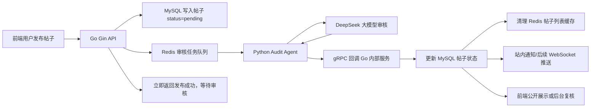

# 寝友Go项目中期报告

## 一、项目概况

“寝友Go”是面向校园宿舍生活场景的综合互助社区平台，主要服务于学生在宿舍楼、校园活动、闲置交易、失物招领、学习互助等场景下的信息发布与互动需求。项目采用前后端分离架构，前端基于 Vue 3、Vite、Pinia、Axios 和 Element Plus 构建用户端与管理员后台，后端基于 Go 语言 Gin 框架开发 RESTful API，并使用 GORM 操作 MySQL 数据库，Redis 用于缓存、计数缓冲和后续异步任务队列扩展。

本阶段项目已经完成了用户注册登录、帖子发布、帖子列表、评论、点赞、收藏、报名、通知、管理员后台、敏感词管理、内容审核管理等核心模块。同时，我们围绕“智能内容安全审核”进行了架构升级设计，并已完成 AI 审核原型、状态字段建模、Redis 基础接入、管理端人工审核入口等前置能力，为后续落地“Redis 异步任务队列 + Python Agent + DeepSeek 推理 + gRPC 回调”的企业级审核闭环奠定了基础。

## 二、现有系统分析

### 1. 前端模块

前端项目位于 `frontend` 目录，整体使用 Vue 3 单文件组件开发。用户侧主要页面包括登录、首页、帖子详情、帖子发布、个人主页、消息列表等；管理侧主要页面包括用户管理、内容审核、违规处理、通知管理、宿舍管理、敏感词管理、分类配置和统计面板。

在发帖流程中，`PostPublish.vue` 已经实现了标题、正文、帖子分类、宿舍楼、图片上传、限时报名等表单能力。用户点击“发布帖子”后，前端会将帖子内容和图片以 `multipart/form-data` 的形式提交到后端 `/api/v1/post/create` 接口。当前页面已经具备发布中的加载状态、错误提示和成功跳转逻辑，为后续异步审核提示语“发布成功，系统正在审核，请稍候”提供了可直接改造的交互基础。

管理员端的 `ContentAudit.vue` 已经实现内容列表、状态标签、关键词筛选、违规下架、恢复、置顶、官方发帖等能力。该页面可以展示 `pending`、`normal`、`canceled` 等状态，并通过 `/api/v1/admin/contents/:id/audit` 修改帖子状态。因此，异步 Agent 返回审核结果后，即使自动审核未覆盖全部情况，管理员仍然可以进行兜底复核。

### 2. 后端模块

后端项目位于 `backend` 目录，采用分层结构组织代码：

- `router`：统一注册用户端、帖子端、消息端、管理员端 API。
- `controller`：接收 HTTP 请求，处理参数绑定和响应封装。
- `logic`：承载业务逻辑，例如发帖、查帖、点赞、评论、AI 润色等。
- `model`：定义 GORM 数据模型并封装数据库操作。
- `ai`：封装 DeepSeek API 调用、AI 审核与 AI 润色能力。
- `redis`：初始化 Redis 客户端，为缓存和异步队列提供基础。
- `task`：定时同步 Redis 中的点赞、浏览量增量到 MySQL。
- `utils`：JWT、敏感词过滤、OSS 上传、雪花 ID 等通用工具。

帖子模型 `DgPost` 中已经包含 `Status` 字段，当前系统使用 `normal` 表示正常展示，`canceled` 表示违规或撤销，前端管理端也预留了 `pending` 待审状态的显示逻辑。普通用户查询帖子列表时，后端 `GetPosts` 只返回 `status = normal` 的帖子，这意味着只要发帖时先写入 `pending`，普通用户就不会立即看到未审核内容。

### 3. 数据库与缓存

MySQL 作为主库，保存用户、帖子、评论、图片、消息、通知、违规记录、敏感词、帖子分类等核心业务数据。项目启动时通过 GORM `AutoMigrate` 自动建表，降低了部署和演示成本。

Redis 已经完成基础接入，并在帖子列表缓存、点赞数和浏览量增量缓冲中投入使用。例如帖子列表使用 `dormgo:posts:page:{page}:size:{pageSize}` 作为缓存键，发布、置顶、审核等操作会主动删除首页缓存；点赞和浏览量通过 Redis 增量键暂存，再由后台定时任务批量回写 MySQL。该部分说明系统已经具备使用 Redis 解耦高频读写操作的工程基础，后续扩展 Redis List 或 Stream 作为审核任务队列成本较低。

## 三、智能审核 Agent 业务流设计与中期完成情况

本次中期重点围绕“企业标配：异步审核 Agent 完整业务流”展开。我们将原有同步审核思路拆分为前台极速响应、数据库状态隔离、Redis 队列削峰、Python Agent 后台推理、gRPC 高速回调、MySQL 状态闭环和前端通知七个环节。

### 1. 前端触发与极速响应

目标流程中，用户点击“发布帖子”后，请求首先进入 Go Gin 服务。Go 服务只负责快速接收请求、校验参数、保存帖子和投递审核任务，而不在 HTTP 请求链路中等待大模型完整推理。

目前项目中已经完成了发帖页面、表单校验、图片上传和 `/api/v1/post/create` 接口调用。后端 `PostCreate` Controller 可以接收标题、正文、发布者、宿舍楼、帖子类型、报名设置和图片等数据。现阶段系统已经具备完整的发帖入口，下一步只需要将返回文案从“发布成功”调整为“发布成功，系统正在审核，请稍候”，并将发布按钮的加载状态从“安全检测中”改为更符合异步体验的短暂提交状态。

中期完成情况：已完成用户发帖入口、表单提交链路和后端请求接入；异步审核提示语和状态轮询/通知逻辑待接入。

### 2. 状态标记与入库

目标流程中，Go 后端收到新帖子后，不直接让帖子进入公开列表，而是先写入 MySQL，并强制将 `Status` 设置为 `pending`。由于普通用户帖子列表只查询 `normal` 状态，待审帖子不会被公开展示。

当前项目已经在 `DgPost` 模型中定义了 `Status` 字段，并在普通帖子列表查询中使用 `status = normal` 过滤条件。管理端内容审核页面也能够识别 `pending` 状态并展示为“待审”。因此，数据库层和查询层已经具备“待审隔离”的关键条件。

目前发帖代码中默认将新帖子状态设置为 `normal`，并在创建前同步调用 AI 审核。中期阶段我们已经明确改造方案：将发帖初始状态调整为 `pending`，先完成 `model.CreatePost(post)` 入库，再投递 Redis 审核任务。待 Agent 返回 PASS 后改为 `normal`，返回 BLOCK 后改为 `canceled` 或扩展为 `rejected`。

中期完成情况：已完成 `Status` 字段、普通列表状态过滤、管理端状态展示；发帖默认状态从 `normal` 改为 `pending` 属于下一阶段改造点。

### 3. 任务下发：Redis 队列

目标流程中，Go 将帖子核心信息封装为任务，例如：

```json
{
  "post_id": 123,
  "title": "闲置台灯转让",
  "content": "九成新，可宿舍楼下自提",
  "publisher_id": 8,
  "created_at": "2026-05-20T10:00:00+08:00"
}
```

随后 Go 将该任务推送到 Redis List 或 Redis Stream。HTTP 接口不等待 AI 审核结果，立即向前端返回成功响应。Redis 在这里承担消息缓冲和削峰填谷的作用：即使 DeepSeek 响应变慢或 Python Agent 短暂重启，发帖请求也不会被大模型链路阻塞。

当前项目已经完成 Redis 初始化和客户端封装，并在帖子缓存、点赞/浏览量缓冲中使用 Redis。说明项目已经具备稳定连接 Redis、读写键值、后台定时消费 Redis 数据的能力。后续审核队列可以复用同一 Redis 客户端，新增类似 `dormgo:audit:post_queue` 的队列键。

中期完成情况：已完成 Redis 基础设施接入和缓存实践；审核任务队列结构已完成设计，待编码接入 `LPUSH/BRPOP` 或 Redis Stream 消费组。

### 4. Agent 获取任务

目标流程中，Python Agent 是独立部署在内网的后台服务，持续监听 Redis 审核队列。它从队列中取出待审帖子后，组装系统提示词、业务上下文和安全规则，再调用 DeepSeek 进行深度审核。

本阶段我们已经完成 Agent 的职责边界设计：Go 服务负责高并发接入、状态流转和数据一致性；Python Agent 负责大模型推理、规则解释、结果结构化和异常重试。这样的拆分符合两种语言的优势：Go 负责稳定的 Web 服务和数据库更新，Python 负责 AI 生态和模型编排。

Agent 计划支持以下能力：

- 从 Redis 队列阻塞式拉取任务，避免空轮询浪费资源。
- 对帖子标题和正文进行合并审核。
- 调用 DeepSeek API，要求模型返回结构化 JSON。
- 对模型返回内容进行格式校验，避免 Markdown 包裹、字段缺失等问题。
- 将结果封装为 `PASS`、`BLOCK`、`REVIEW` 三类。
- 对调用失败的任务进行重试，超过次数后转人工审核。

中期完成情况：已完成 Agent 架构职责划分、任务格式和结果格式设计；Python 服务实体和 Redis 消费循环待实现。

### 5. 深度 AI 推理

当前 Go 后端已经实现 DeepSeek API 调用封装。`ai/client.go` 按 OpenAI 兼容格式构造请求，支持 `model`、`messages`、`temperature` 和 `response_format`；`ai/audit.go` 已经定义了校园社区审核系统提示词，并要求模型返回合法 JSON，例如：

```json
{"status": "PASS", "reason": "内容正常"}
```

或：

```json
{"status": "BLOCK", "reason": "包含诈骗广告"}
```

现有审核规则已经覆盖严重辱骂、诈骗广告、色情描述、暴力恐吓、政治敏感等违规场景，同时允许正常校园生活分享、闲置交易、交友、吐槽等内容。除此之外，系统还实现了本地敏感词过滤，管理员可以在后台维护敏感词，服务启动时会将词库加载到内存过滤器中。这使审核链路具备“本地规则快速拦截 + 大模型语义判断”的组合能力。

中期完成情况：已完成 DeepSeek 调用封装、JSON 模式审核原型、本地敏感词预检和敏感词单元测试；下一阶段将把同步审核逻辑迁移到 Python Agent 中执行。

### 6. 高速状态回调：gRPC

目标流程中，Python Agent 完成审核后，不直接操作数据库，而是作为 gRPC 客户端调用 Go 暴露的内部 gRPC 服务。Go 服务端接收审核结果后统一更新 MySQL 状态。这样可以保证帖子状态流转仍由 Go 业务服务掌控，避免多个服务同时写数据库造成权限和一致性问题。

本阶段我们完成了 gRPC 回调接口的设计，计划定义如下服务：

```proto
service AuditCallbackService {
  rpc SubmitAuditResult(AuditResultRequest) returns (AuditResultReply);
}

message AuditResultRequest {
  uint64 post_id = 1;
  string status = 2;
  string reason = 3;
  double confidence = 4;
}

message AuditResultReply {
  bool success = 1;
  string message = 2;
}
```

Go 服务端收到 `PASS` 后将帖子状态更新为 `normal`；收到 `BLOCK` 后更新为 `canceled`，并可写入违规原因；收到 `REVIEW` 后保持 `pending` 并进入人工审核列表。gRPC 的优势在于内部服务间通信性能高、协议明确、类型安全，适合作为 Agent 与 Go 主服务之间的状态回调通道。

中期完成情况：已完成 gRPC 接口方案和状态映射规则设计；`.proto` 文件、Go gRPC Server 和 Python gRPC Client 待进入编码阶段。

### 7. 闭环更新与用户通知

当 Go 收到 Agent 回调后，最终会更新 MySQL 中对应帖子的 `Status` 字段，并清理帖子列表缓存。当前管理端审核接口已经实现了状态更新和缓存失效逻辑，说明项目已有可复用的状态变更代码路径。

如果审核通过，帖子从 `pending` 变为 `normal`，普通用户可以在首页帖子流中看到该内容；如果审核不通过，帖子进入 `canceled` 或后续扩展的 `rejected` 状态，普通用户不可见，管理员可以在后台查看和处理。项目中已经存在 `DgNotification` 通知模型、消息接口和系统通知能力，因此后续可以在审核通过或驳回时向发帖用户推送站内通知，例如“您的帖子已通过审核”或“您的帖子因包含违规内容未通过审核”。

中期完成情况：已完成帖子状态更新、缓存清理、通知表和消息中心基础能力；自动审核结果通知和 WebSocket 实时推送待扩展。

## 四、当前阶段实际成果

截至中期检查，项目已经完成以下成果：

1. 完成前后端基础架构搭建，前端 Vue 3 与后端 Gin API 已经打通。
2. 完成用户注册登录、JWT 鉴权、个人资料、宿舍信息、帖子分类等基础模块。
3. 完成帖子发布、图片上传、帖子列表、帖子详情、评论、点赞、收藏、报名等社区核心功能。
4. 完成管理员后台的统计、用户管理、内容审核、置顶、违规处理、通知管理、宿舍管理、分类管理和敏感词管理。
5. 完成 MySQL 数据模型设计，帖子表中已具备 `Status` 状态字段。
6. 完成 Redis 客户端接入，并用于帖子列表缓存、点赞/浏览量增量缓冲和缓存失效。
7. 完成 DeepSeek API 调用封装，已实现 AI 润色和 AI 内容审核原型。
8. 完成本地敏感词过滤器，支持启动加载词库、管理员增删词和单元测试验证。
9. 完成异步审核 Agent 的完整业务流程设计，包括 Redis 队列、Python Agent、DeepSeek 推理、gRPC 回调和状态闭环。

## 五、系统架构设计

异步审核 Agent 的目标架构如下：



该架构的主要优点包括：

- 用户发帖接口响应更快，不被 2 到 5 秒的大模型推理阻塞。
- 待审帖子先进入 `pending` 状态，普通列表不可见，降低违规内容外泄风险。
- Redis 队列可以缓冲审核任务，提升系统在高峰期的稳定性。
- Python Agent 与 Go 主服务职责清晰，便于独立开发、部署和扩缩容。
- gRPC 回调性能高、结构清晰，适合内部服务通信。
- 管理端保留人工审核能力，形成“AI 初筛 + 人工兜底”的双保险。

## 六、存在问题与改进计划

虽然项目已经完成大量基础模块，但距离完整企业级异步审核闭环仍有以下工作需要推进：

1. 发帖接口仍处于同步审核模式，需要改造为先入库 `pending`、再投递 Redis 队列。
2. Redis 审核队列尚未编码，需要确定使用 List 简单队列还是 Stream 消费组。
3. Python Agent 服务尚未创建，需要实现任务消费、DeepSeek 调用、结构化结果校验和失败重试。
4. gRPC `.proto`、Go 服务端和 Python 客户端尚未落地。
5. 审核失败原因目前没有独立字段保存，后续可以新增审核日志表或复用违规记录表。
6. 用户端暂未展示“审核中”的个人帖子状态，需要在个人主页中显示待审帖子。
7. 实时通知暂未使用 WebSocket，目前可以先通过站内通知表实现，后续再升级为实时推送。

下一阶段计划分四步完成：

第一步，改造发帖链路。将新帖子默认状态设为 `pending`，保存后推送 Redis 审核任务，并立即返回前端成功提示。

第二步，实现 Python Agent。通过 Redis 阻塞消费任务，调用 DeepSeek 完成语义审核，并输出结构化审核结果。

第三步，实现 gRPC 回调。Go 服务新增内部 gRPC Server，接收 Agent 审核结果并统一更新帖子状态、清理缓存、记录审核原因。

第四步，完善前端体验。用户发布后显示“审核中”，个人中心可查看待审状态；审核通过或失败后进入消息中心通知，条件允许时接入 WebSocket 实时提醒。

## 七、中期总结

目前“寝友Go”已经从基础校园社区系统逐步升级为具备智能审核能力的综合平台。项目在业务功能上已经覆盖用户发帖、互动、通知和后台管理；在工程能力上已经具备 Gin 高并发接入、GORM 数据持久化、Redis 缓存与计数缓冲、DeepSeek API 接入、敏感词过滤和管理端审核等基础。

异步审核 Agent 不是单独增加一个 AI 接口，而是一次完整的架构演进：它将慢速、不稳定的大模型调用从用户请求链路中剥离出来，通过 Redis 队列削峰，通过 Python Agent 专职推理，通过 gRPC 回调完成状态闭环。中期阶段我们已经完成了该方案的总体设计和多项前置模块建设，下一阶段将重点推进队列消费、Agent 服务和 gRPC 联调，最终形成“前端极速响应、后台智能审核、状态自动闭环、人工可兜底”的内容安全系统。
